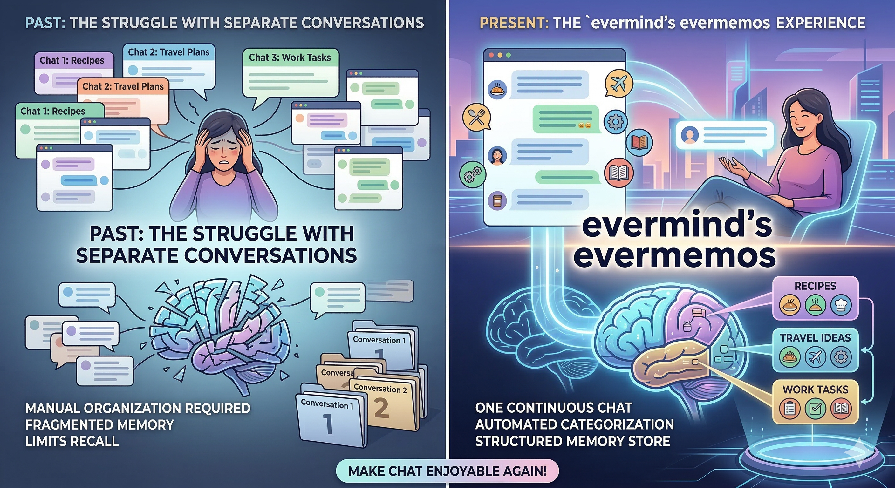
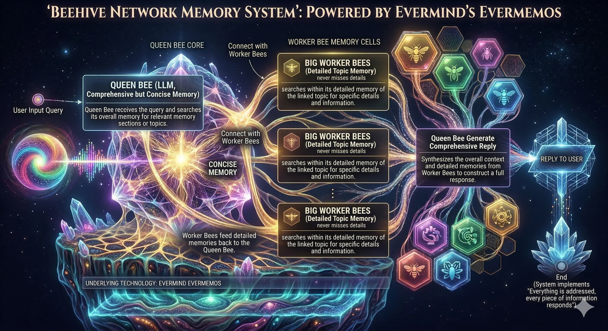

# Evermind

One conversation. Organized memory.

Evermind is a demo of an AI chat experience powered by **evermemos**: while you keep chatting naturally, the system automatically detects topic shifts, stores key context, and lets you recall details without managing multiple threads.

在 Evermind 里，你不需要再把生活和工作拆成无数聊天窗口。你只需要自然地持续对话，系统会自动把信息按主题沉淀成可检索的记忆。

## Why This Product



*左侧是过去的多线程碎片化沟通，右侧是 Evermind + evermemos 的单线程连续对话与自动分类记忆体验。*

> "The left side illustrates the tediousness and fragmentation of the past, where users had to juggle multiple chat threads (e.g., recipes, travel plans, work) just to keep their topics organized.
>
> The right side brilliantly showcases the innovative experience of evermind's evermemos. Within a single, continuous conversation, the AI acts as a highly efficient, intelligent memory bank. It automatically categorizes and stores your discussions (from recipes and travel inspiration to work tasks) into distinct compartments, allowing you to instantly and accurately recall specific details at any time-making chatting a truly effortless and enjoyable experience."

你的产品愿景可以浓缩为下面这张对比图：

| Past (fragmented) | Evermind (continuous + structured) |
|---|---|
| You split ideas across many chat threads: recipes, travel plans, work tasks. | You chat in one continuous thread. |
| Context gets scattered, repeated, and forgotten. | AI acts as an intelligent memory bank in real time. |
| Finding old details is slow and error-prone. | Topics are automatically categorized into clear compartments. |
| Managing chat becomes operational overhead. | Recalling specific information becomes instant and effortless. |

这个仓库就是这套体验的实现骨架。即使完整视觉 demo 还在迭代中，核心能力已经可运行、可验证、可演示。

## What You Can Demo Today

- Continuous chat with topic detection on the backend.
- Automatic topic node creation and flow updates (`/ws/flow/{session_id}`).
- Retrieval from short-term cache + evermemos memory with weighted merge.
- Graceful degradation: if Evermemos write fails, chat still continues.
- Graceful degradation: if LLM fails, API returns a deterministic fallback plan.

## Architecture At A Glance

- `apps/api`: FastAPI backend (chat, memory, health, websocket flow)
- `apps/web`: React + Vite frontend (chat panel + flow panel)
- `packages/shared`: shared TypeScript contracts
- `docs`: product/architecture/deployment notes

### Memory Architecture (Intuitive View) | 记忆架构直观图



*这张图展示了“Queen Bee + Worker Bees”的记忆协作方式：主模型负责全局理解，主题记忆单元负责细节检索，再汇总生成完整回复。*

Core API routes:

- `POST /chat`
- `GET /health`
- `GET /health/evermemos`
- `GET /health/llm`
- `POST /demo/mock-node`
- `WS /ws/flow/{session_id}`

## 3-Minute Quick Start | 3 分钟快速启动

### 1) Prepare Env Files | 准备环境变量

From repo root:

```bash
cp .env.example .env
cp apps/api/.env.example apps/api/.env
```

Env split:

- `/.env`: frontend-only (`VITE_API_BASE_URL`, `VITE_WS_BASE_URL`)
- `apps/api/.env`: backend runtime + secrets

Must configure in `apps/api/.env`:

- `LLM_API_KEY`
- `EVERMEMOS_API_KEY`

### 2) Start Backend | 启动后端 API

```bash
cd apps/api
python3 -m venv .venv
source .venv/bin/activate
pip install -r requirements.txt
uvicorn app.main:app --host 127.0.0.1 --port 8000
```

### 3) Start Frontend | 启动前端页面

From repo root in another terminal:

```bash
npm install
npm run dev:web
```

Open:

- Web: `http://localhost:5173`
- API docs: `http://127.0.0.1:8000/docs`

### 4) Run Smoke Test (Optional) | 可选：运行冒烟测试

```bash
bash scripts/local_smoke_test.sh
```

## Demo Flow Suggestion | 演示建议流程

Use one session ID and send mixed intents in a single chat:

1. Recipe idea
2. Weekend travel plan
3. Work TODO list

Expected behavior:

- Topic detector decides whether to continue current topic or create a new topic node.
- Frontend flow graph receives `flow.node.created` events.
- Follow-up question can retrieve relevant details from merged context.

## Configuration Notes | 配置说明

### Backend env loading order

The backend loads env in this order:

1. `/.env` (fallback)
2. `apps/api/.env` (override, recommended source of truth)

This keeps config stable no matter where `uvicorn` is launched.

### CORS defaults

`FRONTEND_ORIGINS` supports comma-separated origins, and local defaults include:

- `http://localhost:5173`
- `http://localhost:5174`
- `http://127.0.0.1:5173`
- `http://127.0.0.1:5174`

### LLM provider

The gateway is OpenAI-compatible. Typical setup:

- `LLM_PROVIDER=minimax`
- `LLM_BASE_URL=https://api.minimax.io/v1`
- `LLM_MODEL=MiniMax-M2`
- `LLM_STRIP_THINK_TAGS=true`

You can switch to any provider exposing OpenAI-compatible chat completions by changing:

- `LLM_BASE_URL`
- `LLM_API_KEY`
- `LLM_MODEL`

## Project Structure

```text
.
├── apps/
│   ├── api/      # FastAPI + evermemos + LLM gateway
│   └── web/      # React + Vite UI
├── packages/
│   └── shared/   # shared TS contracts
├── docs/         # architecture, product, deployment docs
└── scripts/      # local smoke test and utility scripts
```

## Current Limitations | 当前限制

- In-process state is used for flow/session cache, so run API with single worker (`--workers 1`).
- This is still a demo scaffold; visual polish and narrative demo script can be expanded.

## Next Demo Iteration Ideas | 下一步演示迭代建议

- Better visual storytelling in UI: explicit "topic compartments" timeline.
- Session replay mode: show how one long chat becomes structured memory.
- Side-by-side benchmark: multi-thread workflow vs Evermind one-thread workflow.

## License

This project is released under the **Unlicense**.

You can use it for personal, academic, or commercial purposes with virtually no restrictions. See `LICENSE` for full text.
